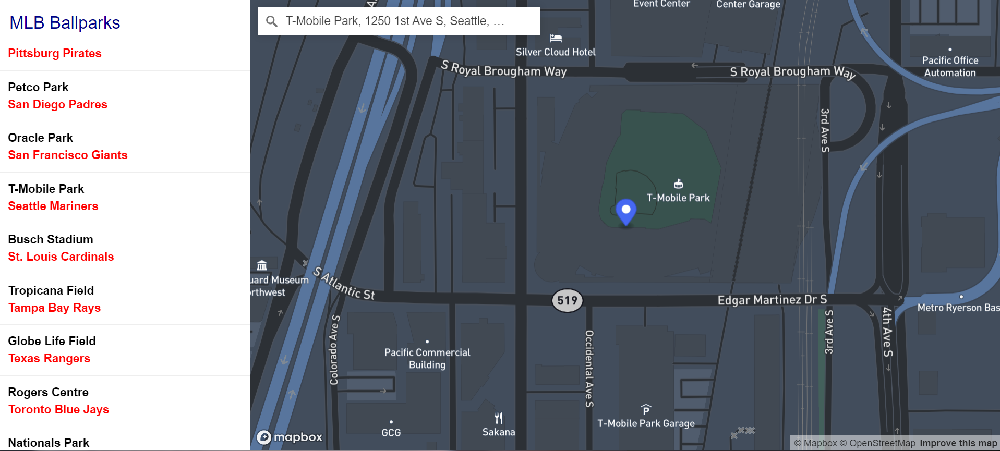

# Exploring the MLB Stadiums

## Created by Shota Shimizu

[Application URL](https://shimizusuw.github.io/geog495_final/index.html)

This application has been created for the Web & Mobile GIS course (GEOG 495) as part of the final project. This application provides and maps all the MLB stadiums, along with listing the professional team that hosts. With this application, the user can find all of the stadiums and information on which team is located there through a geographic visualization. 
On the side bar, the user will be able to find the list of all the stadiums. With the map, the user is able to freely explore, through moving and zooming, the different locations. When a stadium is clicked, it will provide us with a pop-up with more information about the stadium. Furthermore, there is a search bar which allows the user to search any location, regardless of if it is a stadium or not. 

The data for all the stadiums and teams were collected and shared into a geojson file which can be found through ballparks.geojson. 

### References and Data Sources
[Ballpark Information](https://www.ballparksofbaseball.com/)
[MLB](https://www.mlb.com/)

### Applied Libraries and Web Servicesa
[Github](https://github.com/)
[Mapbox Studio](https://studio.mapbox.com/)
[Mapbox Streets](https://www.mapbox.com/maps/streets)

### Acknowledgments
<ul>
    <li> Bo Zhao: Instructor
    <li> Steven Bao: TA
    <li> Mapbox: Mapping
    <li> MLB: Information about baseball
</ul>